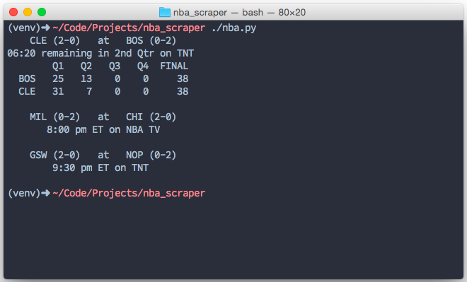
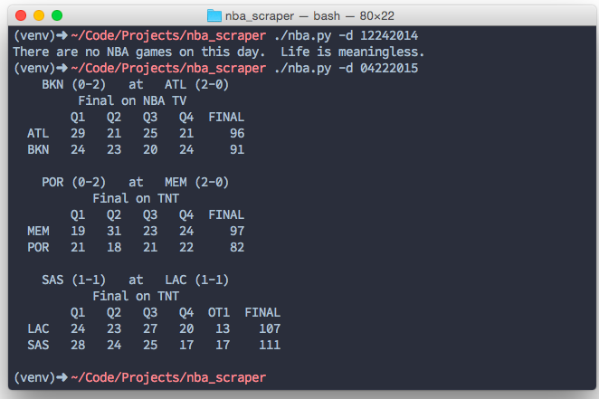

# NBA CLI

This is a command-line interface for the National Basketball League.  I spend alot of time in my terminal, and I wanted to quickly be able to quickly check the scores of today's NBA games.  

### Current Usage:

- `nba` - running the script by its name will return all the scores of todays NBA games.
- `nba -d mmddyyyy` - pass a date to the `-d` argument and it will return all the NBA box scores for that date.

### Currently in Development:

- **New argument:** `-s` returns the current standings
- **New argument:** `-n` returns the top five headlines in the NBA right now